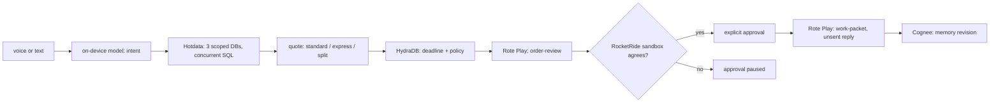

# TRU Synth Order Desk — Voice requests. Real work. Clear approval.

**Tell Synth what you need. Review the plan. Let it do the work.**

**Watch the demo:** [Video](docs/submission/synth-order-desk-demo.mp4) · [Presentation (PDF)](docs/submission/Synth-Order-Desk.pdf) · [Try the public hub](https://trusynth-order-desk.pages.dev) · [Full walkthrough](docs/FULL-WALKTHROUGH.md)

official assets in [submission/](submission/): [DEMO-PROOF.json](submission/DEMO-PROOF.json), [MEDIA-PROOF.json](submission/MEDIA-PROOF.json), [Synth-Order-Desk.pdf](submission/Synth-Order-Desk.pdf), [Narration transcript](submission/TRANSCRIPT.md), [captions.srt](submission/captions.srt), [captions.vtt](submission/captions.vtt), [poster.jpg](submission/poster.jpg), [synth-order-desk-demo.mp4](submission/synth-order-desk-demo.mp4)

**The job.** “Make it 140 shirts instead of 150.” Synth checks sample stock, delivery and budget, shows the revised $1,630 plan, and waits for your approval. Then it prepares the work packet, saves the handoff and remembers your shipping rules for the next request. The same request → review → approved work pattern can help with team events and creator launches; this demo implements the merchandise-order case.


Frozen source identity: `2026-09-11T22:37:05.532039+00:00` (SOURCE-FROZEN.json is included).

## One order, from request to approved work

1. Voice: "Our customer now needs 150 black T-shirts by September 18. Keep it within $1,800." → split shipment, **$1,750**, arrives Sep 18; standard is late, express is over budget. Hotdata rows, HydraDB constraints, the Rote review Play and the RocketRide cross-check all ran for this quote ([integrated-cloud-flow.json](evidence/integrated-cloud-flow.json)).
2. "Actually, make it 140." → **$1,630**; any earlier approval is cleared; the cloud cross-check runs again on the new quantity.
3. "Yes, I approve this exact proposal." → approval recorded for exactly that quote and revision; a later change invalidates it.
4. "Write the approved customer reply and work packet." → the `work-packet` Rote Play writes the packet with an unsent reply; nothing is sent.
5. "Remember: never split shipments." → stored as a company-memory revision in Cognee ([full-flow-verification.json](evidence/full-flow-verification.json)).
6. New conversation: "Review 150 shirts within $1,800." → **no feasible option**: standard is late, express is over budget, split is now forbidden by the remembered rule (test `company instruction survives a fresh session and changes the next decision`).
7. "Make the budget $2,000." → **express, $1,950** — the remembered policy plus the new budget change the decision, not just the wording.

This is the payoff beyond retrieval: remembered instructions and captured procedures change prices, feasibility and approvals on the next request, and the execution (Plays, scoped SQL, cloud cross-check) is reused rather than re-derived.

Live verification receipts from the source machine are in [evidence/](evidence/README.md); the full narrative with timings is [docs/FULL-WALKTHROUGH.md](docs/FULL-WALKTHROUGH.md) (sections 14–15). The served run with the RocketRide cross-check is [evidence/integrated-cloud-flow.json](evidence/integrated-cloud-flow.json).

## Try the three sample plans

Open the static playground locally with `python3 -m http.server 8080 --bind 127.0.0.1 --directory docs`, then visit http://127.0.0.1:8080/. No account or model is needed for these browser calculations. The three scenarios, delivery rows, quantities, budgets and shipment constraints use the same pure quote engine as the app. See [the sample data](public-data/scenarios.json). This is separate from the real sponsor receipts and the Mac voice app. ROOT publication config supplies actual recording, work-ticket and event links; empty URLs remain pending.

## Run it yourself

Requirements are strict because the language model is Apple's on-device model: **macOS 26 with Apple Intelligence enabled and Xcode 26 command-line tools**, plus a local Cognee API and a local HydraDB container. Full list in [docs/PLATFORM.md](docs/PLATFORM.md). Setup downloads pinned npm and Python packages (and you download the speech models); the conversation uses local companion services, opt-in Hotdata and RocketRide, and explicitly enabled browser, Gmail-draft and GitHub-ticket actions. Then:

```sh
judge/setup.sh                      # checks tools, bun install, python venv, builds
set -a; source judge.env; set +a    # paths and optional service settings
judge/test.sh                       # TypeScript check + tests
judge/replay-plays.sh               # both Rote Plays with fresh inputs
judge/voice-check.sh                # transcribe the synthetic voice note locally
judge/start.sh                      # http://127.0.0.1:7790/talk
```

Modes:
- **Local files only** (default): company data comes from `fixtures/company.json`; the receipts say `local company files`. No provider call is made in this mode; Cognee and HydraDB still run locally.
- **Hotdata**: supply your own `HOTDATA_API_KEY` and copy `examples/hotdata-allowance.json` to `run/conversation/hotdata-allowance.json` and set `enabled: true`. Each fresh review then creates three scoped databases, runs the SQL concurrently, probes isolation and deletes them; a repeat review within five minutes with unchanged facts reuses the verified snapshot instead. Databases are created with a 30-minute `expires_at` as a best-effort fallback only; deletion is explicit and its receipt says whether every database was confirmed removed. The allowance caps input size and run count; it is a local cap, not a provider billing control.
- **RocketRide** (optional): your own staging key in `judge.env` and `examples/rocketride-allowance.json` copied to `run/conversation/rocketride-allowance.json` with `enabled: true`; the review is then cross-checked in a pure-Python sandbox and must agree before approval.
- **HydraDB and Cognee** are required for a review turn (the constraint query is a hard dependency) and for cross-conversation memory. Run them locally as described in `docs/PLATFORM.md`.

## What is in this package

- `src/` — the conversation server and browser client actually used in the demonstration (see `EXPORT-MANIFEST.json` for verbatim files, the documented path rewrites, and the three export stubs that replace a private planning dashboard).
- `native/` — the Swift helper for Apple FoundationModels and the Python HydraDB bridge.
- `procedures/` and `plays/` — the two captured Rote Plays (`order-review`, `work-packet`) and the inspectable procedures they execute.
- `fixtures/` — synthetic company data, Play inputs and a synthetic voice note. No customer data.
- `tests/` — the conversation, memory, company-data and Hotdata-worker tests, plus an exported-server boundary test.
- `evidence/` — sanitized receipts from the live runs on the source machine, plus this export's own self-check and scan output when present.
- `docs/` — [architecture](docs/ARCHITECTURE.md), [sponsor proof](docs/SPONSOR-PROOF.md), [provenance](docs/PROVENANCE.md), [security](docs/SECURITY.md), [licences](docs/LICENSES.md), [demo script](docs/DEMO-SCRIPT.md), [platform notes](docs/PLATFORM.md), [submission text](docs/SUBMISSION.md) and the [full walkthrough](docs/FULL-WALKTHROUGH.md).

## Limitations, stated plainly

- Prices, stock and rates are a labelled demonstration dataset. Sample prices and stock are not a supplier quote. The app creates an unsent Gmail draft and an explicitly approved work ticket. A separate fixed-owner demo email requires its own readback. Printful draft 176055721 contains one sample shirt, is unsubmitted and unpaid, and has unconfirmed artwork readiness. It is not a purchase of the 140-shirt plan.
- RocketRide: a gated cloud cross-check is wired into the review turn (`src/rocketride-cloud.ts`, `pipelines/order-review-cloud.pipe`): with `run/conversation/rocketride-allowance.json` enabled and your own staging key, the same deterministic order-review procedure runs as pure Python in a staging `tool_python` sandbox and its verdict must agree before approval. The shipped receipts include the standalone proof (three cases, terminated task, 0.5 credit units) and, when present, the live served conversation with the cloud step (`evidence/integrated-cloud-flow.json`).
- Memory depth: Cognee is used as validated raw-document memory and HydraDB as a direct per-order constraint projection. There is no Cognify-generated persistent graph and no cross-order multi-hop retrieval; the remembered rule changes the next decision, which is the claim, and nothing more.
- RocketRide is deterministic execution and verification of the quote in a sandbox, not agent fan-out or wave orchestration. Rote's two Plays are real reusable procedures; no first-run-versus-replay speed or token benchmark was measured.
- Voice: George confirmed the physical EarPods microphone and clearly spoken replies on the source Mac at 12:52 PM PT on September 11 (user acceptance, `evidence/physical-voice-check.json`). iOS and non-localhost hosts were not tested.
- The conversational voice app runs on the Mac platform above. The static playground and temporary Tenki saved-work/live-computer views are separate public surfaces; Apple reasoning is not hosted.
- Security: see [docs/SECURITY.md](docs/SECURITY.md) for this exact export's dependency and Snyk Code scan receipts. Code is enabled; historical candidate18 reported nine open findings. No clean claim carries forward from that candidate. The separate local Cognee1.5.4 runtime carries a disclosed critical advisory.

<details>
<summary>How the recorded workflow uses the stack</summary>

**The stack, as actually run.** Apple's on-device language model interprets the request; whisper.cpp transcribes voice; Microsoft Ava natural speech can speak already-confirmed replies, with local system speech also available. Each fresh review loads the company facts into three role-scoped [Hotdata](docs/SPONSOR-PROOF.md#hotdata) databases and queries them concurrently (repeat reviews within five minutes reuse a verified snapshot); [HydraDB](docs/SPONSOR-PROOF.md#hydradb) returns the order's deadline and shipment rule; a captured [Rote](docs/SPONSOR-PROOF.md#rote) Play recomputes the quote and, when the allowance is on, a [RocketRide](docs/SPONSOR-PROOF.md#rocketride) staging sandbox cross-checks it before approval; a second Rote Play writes the approved packet; each company-memory revision is stored in and restored from [Cognee](docs/SPONSOR-PROOF.md#cognee). [Snyk](docs/SECURITY.md) scanned this package's dependencies. The recorded Apple path uses no cloud language model. Optional GPT-Live voice is a separate, explicitly enabled path; see [live voice scope](docs/LIVE-VOICE.md).



</details>

**Category:** Main Track — Compound Agents, as an adaptation of the suggested *Compounding Support Desk* idea to merchandise orders ([official guide, section 4](https://docs.google.com/document/d/14FdPbLDZUuUei7JtLK-oQJeivwzej8ik-_PgCrs1EmY/edit); verified copy hash in [evidence/submission-category.json](evidence/submission-category.json)). Sponsor prizes pursued: Best Use of Hotdata (primary), RocketRide (secondary). No Parallel Agents or Best Agent Telemetry claim.

## Six sponsors: job → repeated work removed → proof

| Sponsor | Job in this order | Repeated work it removes or records | Proof |
|---|---|---|---|
| Hotdata | Each fresh review loads inventory, rates and rules into three role-scoped databases and queries them concurrently; probes isolation; deletes them | Nobody re-checks stock and rates by hand per amendment; every quote carries database IDs, query IDs and returned rows | [hotdata-order-proof.json](evidence/hotdata-order-proof.json), [integrated-cloud-flow.json](evidence/integrated-cloud-flow.json); code `src/data-workers.ts`, `src/hotdata-http.ts` |
| HydraDB | Order → deadline and order → policy relations written and read back on every review; the returned values feed the review Play | The deadline and shipment rule are not re-typed into each quote; a changed constraint changes the recommendation | [integrated-review.json](evidence/integrated-review.json), [full-flow-verification.json](evidence/full-flow-verification.json); code `native/hydra_order.py` |
| Cognee | Every company-memory revision (instructions, approvals) stored as a raw document; a fresh conversation restores the newest with stale-revision protection | The owner teaches a rule once ("never split"); later conversations apply it and change the feasible choice | [full-flow-verification.json](evidence/full-flow-verification.json), [cognee-cache-recovery.json](evidence/cognee-cache-recovery.json); code `src/cognee-memory.ts` |
| Rote | Two captured Plays run on every review and every approved packet | The quote and the packet are recomputed by an inspectable captured procedure instead of re-derived each time; stale approvals are refused | [rote-plays-proof.json](evidence/rote-plays-proof.json), `judge/replay-plays.sh`; code `plays/`, `procedures/` |
| RocketRide | The review is recomputed in a staging Python sandbox and must agree before approval; credit floor and run cap | An independent execution surface confirms each quote before money-relevant approval; tasks are terminated and units accounted | [integrated-cloud-flow.json](evidence/integrated-cloud-flow.json), [rocketride-cloud-proof.json](evidence/rocketride-cloud-proof.json); code `src/rocketride-cloud.ts`, `pipelines/` |
| Snyk | Dependency and code scans of exactly this package | Findings are recorded with dispositions on every export instead of being re-audited by hand | [docs/SECURITY.md](docs/SECURITY.md), `evidence/snyk/` |
