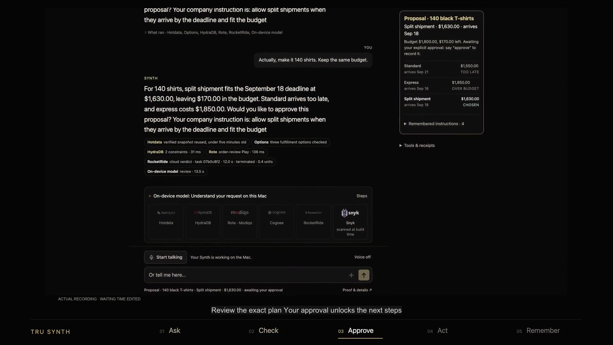
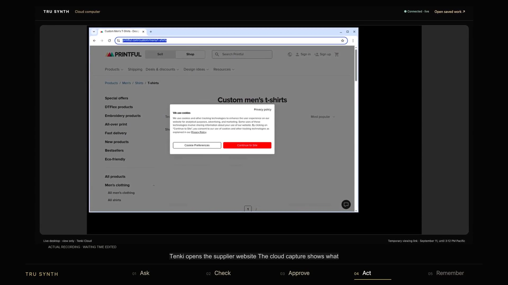
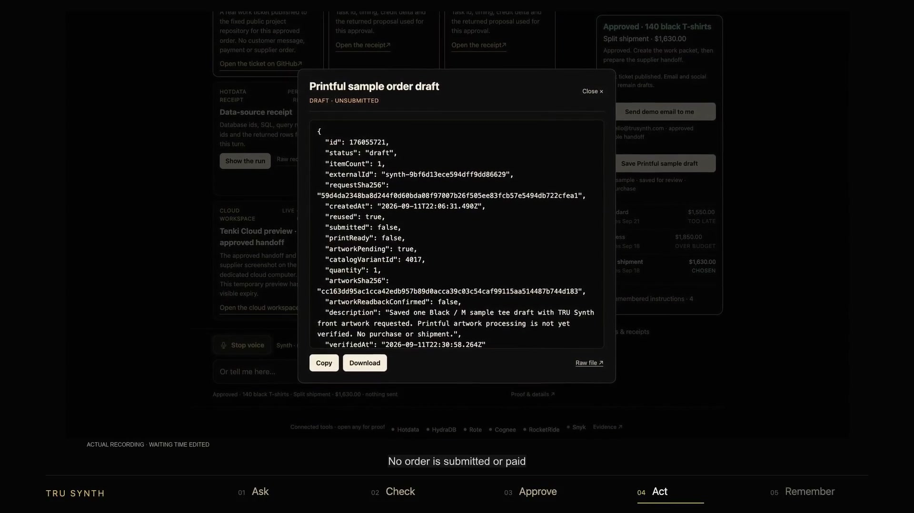
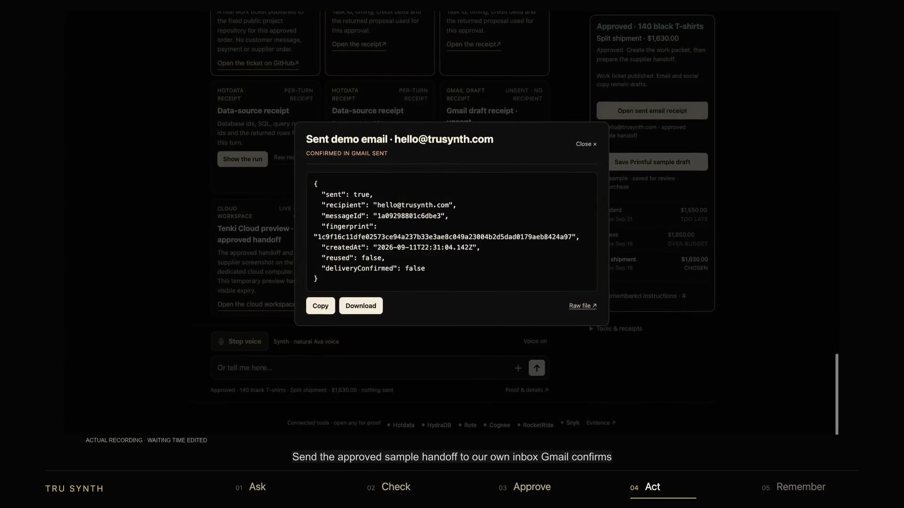

# Judge evidence map

Start with the [98-second film](https://trusynth-order-desk.pages.dev/submission/synth-order-desk-demo.mp4), then verify the parts that matter to your category. The filmed workflow starts from an empty chat and ends with a different conversation applying a remembered policy.

## Demonstration assets

| Asset | File |
|---|---|
| Narrated, captioned 1080p film | [MP4](../submission/synth-order-desk-demo.mp4) |
| Complete source capture, before pacing edits | [149-second MP4](../submission/full-session.mp4) |
| Seven-slide explanation | [PDF](../submission/Synth-Order-Desk.pdf) |
| Accessible narration | [Transcript](../submission/TRANSCRIPT.md), [VTT](../submission/captions.vtt), [SRT](../submission/captions.srt) |
| Story, edits and disclosure | [Screenplay](../submission/SCREENPLAY.md) |
| Fresh-session and action proof | [DEMO-PROOF.json](../submission/DEMO-PROOF.json) |
| Encoding, audio, caption and visual QA | [MEDIA-PROOF.json](../submission/MEDIA-PROOF.json) |
| Actual Hotdata and RocketRide receipts | [final-flow-receipts.json](../evidence/final-flow-receipts.json) |

The film uses a prerecorded voice note, actual local transcription and application/provider responses. Ava narration is added separately; waiting time is edited. The supplier-browser shot holds a visible result from that same fresh capture. The labelled Higgsfield outro is editorial imagery. Printful is a saved sample draft, not a paid order.

## Visible proof

| Approved work | Real cloud browser |
|---|---|
|  |  |

| Sample supplier draft | Owner email |
|---|---|
|  |  |

[Remembered policy](../submission/frame-remember.jpg) · [Security evidence](../submission/frame-security.jpg)

## Claims mapped to proof and source

| Claim | Evidence | Implementation |
|---|---|---|
| Concurrent, isolated Hotdata work | Fresh receipts include SQL, returned rows, query IDs, overlap and six confirmed deletions | [Workers](../src/data-workers.ts), [REST adapter](../src/hotdata-http.ts) |
| A change invalidates approval | Fresh 150 → 140 state checks and regression tests | [Approval fingerprint](../src/approval-proof.ts), [conversation](../src/local-conversation.ts) |
| Repeatable procedures | [Both replay results](../evidence/rote-plays-proof.json) | [Review Play](../plays/order-review/main.ts), [packet Play](../plays/work-packet/main.ts) |
| Cloud computation agrees | Four real staging checks, termination and 1.6 grant-unit delta in the fresh run | [Adapter](../src/rocketride-cloud.ts), [pipeline](../pipelines/order-review-cloud.pipe), [staging export](../pipelines/order-review-cloud.staging-export.pipe) |
| Memory changes a later decision | The fresh run rejects $1,800 after “never split,” then allows $1,950 express at $2,000 | [Cognee memory](../src/cognee-memory.ts), [recovery receipt](../evidence/cognee-cache-recovery.json) |
| Approved work reaches a real destination | [Fresh work ticket #6](https://github.com/gtrush03/synth-order-desk/issues/6), Printful and email receipts in DEMO-PROOF | [Ticket](../src/work-ticket.ts), [Printful](../src/printful-draft.ts), [owner email](../src/project-email.ts) |
| Exact exported source was checked | [Self-check](../evidence/self-check/self-check.txt), [Snyk results](SECURITY.md), [manifest](../EXPORT-MANIFEST.json) | [Test runner](../judge/test.sh), [integrity verifier](../judge/verify-export.py) |

The fresh receipt bundle omits task-token prefixes and private filesystem paths. It retains original-receipt hashes and describes those redactions. Hashes for private capture metadata identify retained source evidence; the complete public source video and selected safe receipts/screenshots provide the reviewable artifacts.

## Repository map

`src/` and `native/` contain the assistant. `procedures/` and `plays/` contain reusable work. `pipelines/` contains both RocketRide files. `tests/`, `fixtures/` and lockfiles support reproduction. `public-cloud/` contains cloud-view source. `event-workspace/` is the separate visitor-signup companion, whose consent window ended at 3:15 PM PDT. `docs/` is the hosted judge hub. The package excludes credentials, participant data and the owner's delivery address.

Read [setup](PLATFORM.md), [architecture](ARCHITECTURE.md), [sponsor scope](SPONSOR-PROOF.md), [security](SECURITY.md) and [the full walkthrough](FULL-WALKTHROUGH.md).

## Repository measurements and GitHub player

[Code count](../evidence/final-flow-code-stats.json) lists all 82 counted files and their hashes. [GitHub-hosted player proof](../evidence/final-flow-github-video.json) verifies anonymous access and the 720p playback copy; the linked full HD film preserves the original 1080p export.
